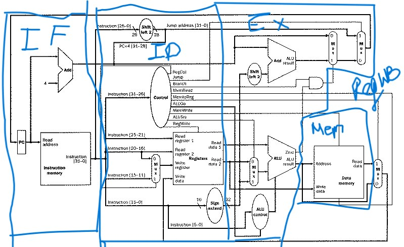
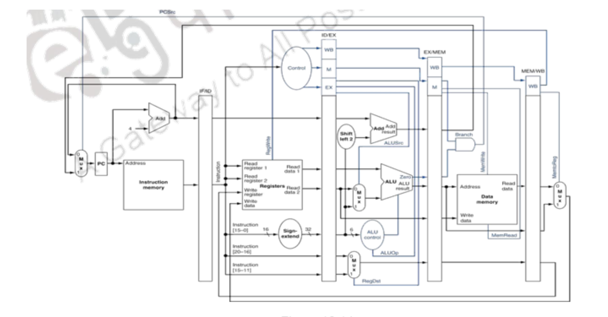

# MIPS_Processor

## Instructions to run this code on your device

clone this repository in your local device. This project contains two types of processors:- `Non-Pipelined` and `Pipelined`, also contains two `.png` files that showcases how the processor work

## Commands this processor can handle 

```opcodes
#Rformats
RFORMAT = '000000'
ADD = '000000'
SUB = '000000'
AND = '000000'
OR = '000000'
SLT = '000000'

#Iformats
BEQ = '000100'
LW = '100011'
SW = '101011'
ADDI = '001000'

#Jformats
J = '000010'

#MUL
MUL = '011100'
```


## Non-Pipelined Processor:



#### `ALU.py` : contains the ALU part of the processor, that generates ALU control signals and also perfroms ALU operations for the processor.
#### `Control.py` : Generates Contrl Signals for the instruction during an iteration.
#### `Resgister_File.py` : Simulates a Register File in a proceesor, performs functions like **WriteBack into register** and performing reading data from the register.
#### `opcodes.py` : Contains the opcodes of different instructions used in the program, R-type, I-type, J-type.
#### `main.py` : Reads instructions from a file in the form of a binary string. Performs different stages of MIPS, namely Instruction Fetch(IF), Instruction Decode(ID), Instruction Execute(EX), Memory Access(MEM) and Write Back(WB). Also prints the initial and final state of the memory and Registers.
#### `converter.py` : contains functions to convert binary to hexadecimal, hexadecimal to binary and binary to hexadecimal.
#### `Registers.py` : contains a map of binary string to register value and name(the binary string is the binary representation of the register).
#### `Memory.py` : Hold the Data and Instruction memory of the program.

## Pipelined Processor:


**most files remain the same, there r some minor changes in a few files.**

#### `forwarding_hazard.py`: contains the forwarding and hazard unit, that handles forwarding of data from one pipelined register to another. It also handles hazards: control hazard and read-write hazard. When the flow is disrupted due to jump/ branch, pipelined registers are updated accordingly. 
#### `pipelined_reg.py`: stores the info of pipelined_registers and also handles functions like flushing pipelined registers and updating them.


`The code also prints the approximate number of cycles and time(assuming each cycle in avg in pipelined is 250ps, and nonpipelined a cycle is 1100ps) a set of assembly instructions take to run on pipelined and non-pipelined processor.`

### Forwarding and Hazard control
```python
def updateforwading_sig(rs,rt):
    cntrlA, cntrlB = '00', '00' #from IDEX, no forwarding

    if(MEMWB["reg_write_data"] == rs and MEMWB["Control_Sig"]["RegWrite"]==1 and MEMWB["reg_write_data"]!='' and (EXMEM["reg_write_data"] != rs or EXMEM["Control_Sig"]['RegWrite'] == 0 or EXMEM["Control_Sig"]["MemtoReg"])):
        cntrlA = '01'   #from EXMEM, forwarding
    elif(EXMEM["reg_write_data"] == rs and EXMEM["Control_Sig"]["RegWrite"]==1 and EXMEM["reg_write_data"]!=''):
        cntrlA = '10'   #from MEMWB, forwarding


    if(MEMWB["reg_write_data"] == rt and MEMWB["Control_Sig"]["RegWrite"]==1 and MEMWB["reg_write_data"]!='' and (EXMEM["reg_write_data"] != rt or EXMEM["Control_Sig"]['RegWrite'] == 0)or EXMEM["Control_Sig"]["MemtoReg"]):
        cntrlB = '01'  
    elif(EXMEM["reg_write_data"] == rt and EXMEM["Control_Sig"]["RegWrite"]==1 and EXMEM["reg_write_data"]!=''):
        cntrlB = '10'        

    return cntrlA, cntrlB
```
